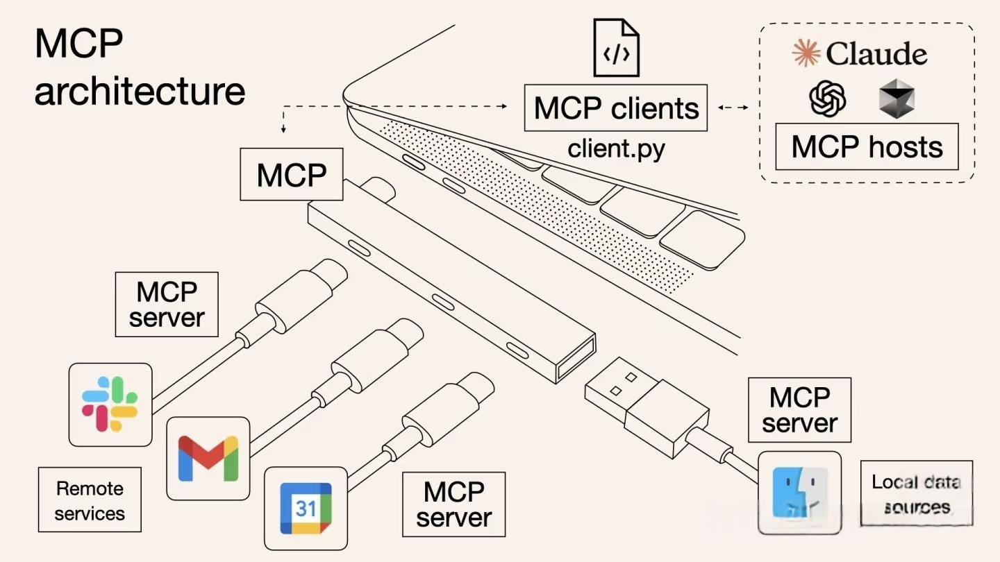
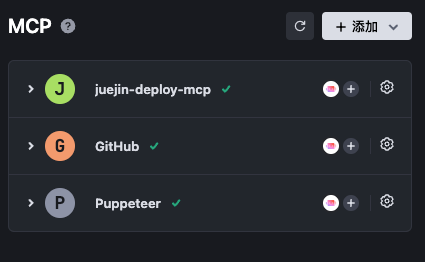

### 1、 什么是mcp
MCP 起源于 2024 年 11 月 25 日 Anthropic 发布的文章：Introducing the Model Context Protocol。MCP （Model Context Protocol，模型上下文协议）定义了应用程序和 AI 模型之间交换上下文信息的方式。这使得开发者能够以一致的方式将各种数据源、工具和功能连接到 AI 模型（一个中间协议层），就像 USB-C 让不同设备能够通过相同的接口连接一样。MCP 的目标是创建一个通用标准，使 AI 应用程序的开发和集成变得更加简单和统一。



### 2. Why MCP?

MCP 的出现是 prompt engineering 发展的产物。更结构化的上下文信息对模型的 performance 提升是显著的。我们在构造 prompt 时，希望能提供一些更 specific 的信息（比如本地文件，数据库，一些网络实时信息等）给模型，这样模型更容易理解真实场景中的问题。想象一下没有 MCP 之前我们会怎么做？我们可能会人工从数据库中筛选或者使用工具检索可能需要的信息，手动的粘贴到 prompt 中。随着我们要解决的问题越来越复杂，手工把信息引入到 prompt 中会变得越来越困难。为了克服手工 prompt 的局限性，许多 LLM 平台（如 OpenAI、Google）引入了 function call 功能。这一机制允许模型在需要时调用预定义的函数来获取数据或执行操作，显著提升了自动化水平。但是 function call 也有其局限性（我对于 function call vs MCP 的理解不一定成熟，欢迎大家补充），我认为重点在于 function call 平台依赖性强，不同 LLM 平台的 function call API 实现差异较大。例如，OpenAI 的函数调用方式与 Google 的不兼容，开发者在切换模型时需要重写代码，增加了适配成本。除此之外，还有安全性，交互性等问题。数据与工具本身是客观存在的，只不过我们希望将数据连接到模型的这个环节可以更智能更统一。Anthropic 基于这样的痛点设计了 MCP，充当 AI 模型的"万能转接头"，让 LLM 能轻松的获取数据或者调用工具。更具体的说 MCP 的优势在于：生态 - MCP 提供很多现成的插件，你的 AI 可以直接使用。统一性 - 不限制于特定的 AI 模型，任何支持 MCP 的模型都可以灵活切换。数据安全 - 你的敏感数据留在自己的电脑上，不必全部上传。（因为我们可以自行设计接口确定传输哪些数据）


### 3. 用户如何使用 MCP？

对于用户来说，我们并不关心 MCP 是如何实现的，通常我们只考虑如何更简单的用上这一特性。

我们就拿trae来举例子



我就装了三个 mcp 工具，直接在 mcp 的市场安装就行

### 4、 用了 mcp 有什么效果


## 核心概念

### 1. 协议架构

MCP 采用客户端-服务器架构：
- **MCP 客户端**：AI应用程序（如Claude Desktop、IDE插件等）
- **MCP 服务器**：提供特定功能的服务（如文件系统访问、数据库查询、API调用等）
- **协议层**：标准化的通信协议，确保客户端和服务器之间的互操作性

```
┌─────────────────┐    MCP Protocol    ┌─────────────────┐
│   AI 客户端      │ ←──────────────→  │   MCP 服务器     │
│ (Claude Desktop) │                   │ (文件系统/数据库) │
└─────────────────┘                   └─────────────────┘
```

### 2. 主要组件

#### Resources（资源）
- 由MCP服务器暴露的数据源
- 可以是文件、数据库记录、API响应等
- 具有唯一的URI标识符
- 支持订阅机制，可以监听资源变化

#### Tools（工具）
- 服务器提供的可执行功能
- AI模型可以调用这些工具来执行特定操作
- 例如：文件操作、数据库查询、API调用等

#### Prompts（提示）
- 预定义的提示模板
- 可以包含动态参数
- 帮助AI模型更好地理解和使用特定功能