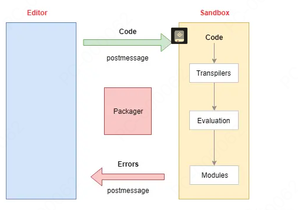

# 云组件
 所谓云组件是一个为了替代组件库的东西，为了更灵活的使用通用组件，来解决内部重复开发问题类似于 bit 

## 解决组件库的什么痛点
 1. 企业内组件问题搜集困难
 2. 二次开发成本高
 3. 需要专人维护
 4. 组件库更新慢
## 云组件的优势
 1. 组件库更新快
 2. 组件开发成本低
 3. 组件库维护成本低
 4. 组件库使用成本低
 5. 组件可本地更改使用
  

## 项目难点，云组件在线预览效果的实现

### 实现在线代码编辑器（ide）

1、CodeSandbox（纯浏览器编译）
2、StackBlitz （web container 这是一个完全新颖的基于 WebAssembly 的操作系统，它使Node.js能够完全在浏览器内部运行）

### 最后选了 CodeSandbox 技术思路

因为是纯浏览器端纯 js 实现编译渲染，开发成本低，实现难度低
相当于是实现一个浏览器端的 webpack 打包工具

核心难点，如何实现编译渲染，如何实现代码渲染沙箱，如何实现 npm 包引入
 

### 代码渲染沙箱

iframe 天然沙箱解决渲染问题，以及编译问题

主要难点就是设计iframe、webworker通信机制架构设计

### iframe 通信机制设计

首先就是项目初始化，要和预览功能分为两个项目，一个是编辑器，一个是编译预览器，
这样做有两个好处
1、编译预览功能能独立运行，互不影响，我们只需要将代码传入即可
2、方便独立维护，减少项目耦合所带来的可维护问题

编译器由于是个独立的项目，所以就是个线上地址链接，我们只需要创建 iframe 即可，就可以形成独立沙箱，在沙箱中实现编译渲染

通信机制设计，其实就是个简单的消息机制，利用 iframe 自带的 postMessage 方法，实现消息传递

然后一用type 来区分消息类型，目前消息类型的分类有init、 compile、getMessage 等

区分 type 的原因就是为了区分不同的功能和作用

### 编辑器部分不在赘述，主要就是利用插件 monaco-editor 来实现代码编辑器的功能
当然也可以用 codemirror5 来实现，主要看个人喜好和习惯

### 编译器部分

主要的编译渲染步骤
1、 初始化实例
2、启动配置
3、编译代码保存代码
4、eval 执行代码
5、渲染组件

#### 初始化实例
 初始化实例主要包含几个步骤
- 初始化消息总线系统
- 处理编译请求
- 监听运行时错误
- 管理控制台输出
- 处理页面大小变化
建立整体的编译环境、编译上下文等等

### 如何实现编译渲染
实现编译就是根据编译上下文中的编译配置，其实就是 webpack 那一套，然后逐个的编译代码
并且保存在上下文中，然后在运行时执行代码，最后渲染组件

其实整体的编译步骤就是跟 webpack 的编译步骤一样的，

- 确定入口：根据配置中的entry找出所有的入口文件（入口就是传入的代码）
- 编译模块：从入口文件出发，调用所有配置的Loader对模块进行转换
- 完成模块编译：得到每个模块被翻译后的最终内容以及它们之间的依赖关系
- 
- 输出资源：根据入口和模块之间的依赖关系，组装成一个个包含多个模块的Chunk
- 输出完成：最后吧输出的资源变成一个大的map存在内存里，
这个对象，是符合文件的依赖关系的， 并且其中保存的就是 module ，当热跟新的时候，就是对 module 进行更新，其中还包含依赖的npm 代码只是这个依赖的 npm 代码是通过 http 请求的，其他代码是编译的

### 组件渲染
组件渲染的话，其实就是把编译后的代码，通过 eval 执行，然后在运行时执行代码，最后渲染组件

### 遇到了那些难点和挑战

1、中间 js 的编译是非常耗时的，导致 js 编译的时候非常卡，所以最后尝试使用了 web wroker 用一个单独的线程来编译 js 
2、npm依赖处理，我们知道npm这个事情是很难搞的，涉及到版本问题，依赖问题等等，
后来我们发现，所有的业务中，我们引用的容易出错的依赖只有几个，首先是 vue 、react 这种，其次vant ，element 这种，其他的比如工具函数是的，我们直接正常去请求最新的就行， 所以我们当时，为了规避和简化这些问题，根据项目特性和实际情况固定了一些项目的版本，  你比如说 vue2 和 vue3 的版本问题，固定了项目模板版本，从输入测解决问题 分别是 2.6 、2.7、3.0 版本
我们在后端有一个配置，分别配置了，2.6、2.7、3.0 这三个版本的无依赖 commonjs 版本 
3、怎么实现模块化的问题， esmodule 指定不能用，我们最后选择了 模拟 commonjs 的模块化方式 相当于我们自己写了个 exprot  和 require 并且这个exprot和require 是保存在当前那个编译模块中的

### 为什么不通过浏览器支持es6 新特性实现

这个恐怕是不行，因为，本质上，es6 我们的本地静态文件被读取，然后执行，也就是说他每次找文件就相当于是一个请求，每次请求是非常耗时的，所以我们必须要一次请求，来解决问题，所以当时只能选择 webpack 的编译方式

而且这时候热更新也是个问题，我们有改动的时候，我们要保存线上传服务器，然后再去请求，这时候就相当于是一个请求，所以热更新也是个问题，所以我们只能选择 webpack 的编译方式

webpack 的方式好处就是，我们上传服务器和本地通过 postMessage 通信不冲突，我们可以实现即时编译

检测到那个文件变动，我们只需要重新编译当前变动的那个文件，然后重新通过 eval 执行一下那一段代码就行，由于 vue 或者 react 支持热更新，所以我们只需要重新执行一下那一段代码就行，然后就可以实现热更新了 比如 vue 主要就利用vue-hot-reload-api 实现的

