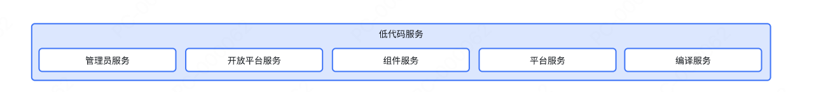

<!-- @format -->

# 这是低代码

低代码系统是一种软件开发平台，允许用户通过图形化界面和少量手动编码快速构建应用程序。它旨在降低开发门槛，使非专业开发者和业务人员也能参与应用开发。

### 核心特点
1. **可视化开发**：通过拖放组件和配置选项，减少手动编码需求。
2. **预置模板**：提供现成的模板和模块，加速开发进程。
3. **自动化工具**：自动生成代码、测试和部署，提升效率。
4. **集成能力**：支持与现有系统和第三方服务无缝集成。
5. **跨平台支持**：开发的应用程序可运行于多种设备和操作系统。

### 优点
- **开发速度快**：显著缩短开发周期。
- **成本低**：减少对专业开发者的依赖，降低人力成本。
- **灵活性高**：支持快速迭代和修改。
- **易于维护**：系统自动生成标准代码，便于后续维护。

### 缺点
- **功能受限**：复杂需求可能难以实现。
- **性能问题**：自动生成的代码可能不如手动优化代码高效。
- **依赖平台**：可能受限于特定平台的功能和更新。

### 应用场景
- **企业内部应用**：如HR、财务管理系统。
- **快速原型开发**：用于验证概念或展示功能。
- **业务流程自动化**：简化复杂流程，提升效率。

低代码系统通过简化开发流程，使更多人能够参与应用构建，尤其适合快速开发和迭代的场景。目前可以讲述的低代码分两种

* **1、 运营低代码**
* **2、 组件低代码**

## 运营低代码平台

这是一个通过可视化拖拽组件的方式，来构建运营页面的系统。 主要就是一些简单的落地页， 引流页面 ，还有一些活动页面等等

### 架构设计

一个大型平台首先要有代码一定要分块，增加可维护性，所谓我们当时做划分的时候划分为一下模块
1、组件生成脚手架
2、管理员平台（内部包含组件开放平台）
3、组件开放平台
4、组件工具库函数
5、渲染引擎
6、组件编译器
7、平台服务端

### 包含已下服务

主要接触比较多的是编译渲染，和组件开放平台这块

## 组件低代码平台
组件低代码平台是一种基于可视化开发模式的应用程序构建工具，其核心在于通过预置模块化组件、图形化界面和自动化逻辑编排，显著降低开发复杂度和组建复用率。这个跟 bit 类似，是一个在线动态组建库

## 主要工作内容
我主要的工作内容，之前重构过渲染器的整体架构，重构包含以下几部分
1、 采用 rem 布局，来解决渲染器的移动端适配问题
2、 重写了渲染策略，
    1、解决了一些性能开销优化，比如，模板请求前置，能快速获取组件信息并且全局注册，分批加载来解决长运营页面的性能开销问题
    2、简化组件嵌套问题 给页面信息，切割为三个类型，第一page 就是页面， 第二，元素，就是堆叠的组件， 第三种，遮罩来解决一些层级堆叠的问题 这样页面遮罩之间都是平级的定位结构， 只有小型的组件，比如图标啊，返回按钮啊，这些，才会启动嵌套结构，减少了之前乱嵌套的乱象
    3、优化了组件之间的通信机制，之前是采用 bus总线的方式通信，但后来由于每个组件的写法不一样有的不是 ，我们全局集成了 mitt 来实现通信并且支持消息回放，就是通过事件，能知道之前的传值，之前的传值被缓存了， 
    

第二个工作内容就是参与编写了很多运营动态组件，这个就比较简单了，其实就是正常的项目开发，然后利用最后打包成一个 js 被render全局注册，供给项目使用

