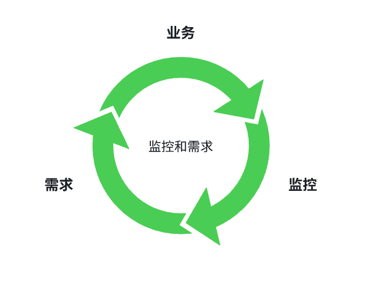
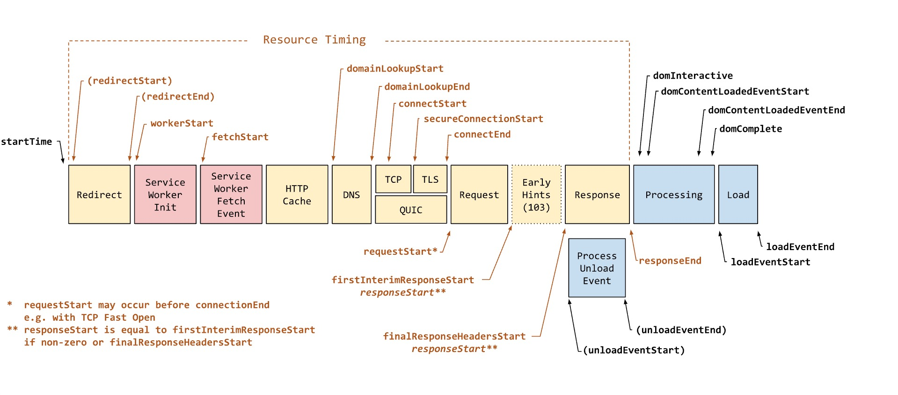

<!-- @format -->

# 前端监控

## 什么是前端监控

前端监控用一句话来描述 **利用一切手段监听上线项目的运行情况**

所谓前端监控体系，只是我们发明的一个时髦的词而已，本质上来讲他不过是我们为了了解项目的运行情况的一个手段，只是这个手段涉及前后端，所以我们称之为前端监控体系

当我们理解了这个内核，我们就能很清晰知道我们应该从哪些方向着手去做前端监控，因为我们想要了解的指标就那么多，相应的要达到目的的手段也就那么多

## 前端监控的目的

说起前端监控的目的

很多人只知道做前端监控， 却不知道他的目的是什么，我做他到底有什么用？

因为在大多数人的职业生涯中，只知道埋头干活，却不知道抬头看路，任何事情的产生，都有他产生的理由，前端监控同样如是

之所以大多数人不了解前端监控的目的，是因为他们项目的体量还没有达到需要监控的地步，他们去研究监控的目的，只是因为他比写业务高端

所以，我们在开始研究之前，要弄清楚前端监控到底到底高不高端

答案显而易见： 一点也不高端

我们要清晰的知道，所有的技术都是为业务服务的， 前端监控的诞生，也只是为了更了解我们的业务，所以本质上来说，他跟你写业务没有任何区别

只是前我们的业务是前台，注重用户体验，我们的监控是后勤，注重数据收集，分工不同，仅此而已

完善的监控体系可以从事前预警、事后分析、和性能分析中得到数据

然后再把搜集到的数据，给产品提供决策，作为给产品的需求，在改善前台的用户体验

他是一个循环的过程



## 监控的指标

前端监控可以分为三类：数据监控（埋点）、性能监控和异常监控。

### 数据监控（埋点）

所谓数据，就是监听用户的行为，常见的监控项有：

PV/UV:PV(page view)：即页面浏览量或点击量；UV：指访问某个站点或点击某条新闻的不同 IP 地址的人数

用户通过什么入口来访问该网页

用户在相应的页面中触发的行为

用户在每一个页面的停留时间

通过以上数据分析用户行为链路

#### 监控方式

数据监控主要通过埋点的方式来实现，目前常见的前端埋点方法有三种：手动埋点、可视化埋点和无埋点。

1、手动埋点
手动埋点，也叫代码埋点，即纯手动写代码，调用埋点 SDK 的函数，在需要埋点的业务逻辑功能位置调用接口，上报埋点数据，像友盟、百度统计等第三方数据统计服务商大都采用这种方案。

手动埋点让使用者可以方便地设置自定义属性、自定义事件；所以当你需要深入下钻，并精细化自定义分析时，比较适合使用手动埋点。

手动埋点的缺陷就是，项目工程量大，需要埋点的位置太多，而且需要产品开发运营之间相互反复沟通，容易出现手动差错，如果错误，重新埋点的成本也很高。这会导致整个数据收集周期变的很长，收集成本变的很高，而且效率很低。因为手动埋点需要开发人员完成，所以每次有埋点更新，或者漏埋点，都需要重新走上线发布流程，更新成本也高，对线上系统稳定性也有一定危害。

2、可视化埋点
通过可视化交互的手段，代替上述的代码埋点。将业务代码和埋点代码分离，提供一个可视化交互的页面，输入为业务代码，通过这个可视化系统，可以在业务代码中自定义的增加埋点事件等等，最后输出的代码耦合了业务代码和埋点代码。缺点就是可以埋点的控件有限，不能手动定制。

可视化埋点听起来比较高大上，实际上跟代码埋点还是区别不大。也就是用一个系统来实现手动插入代码埋点的过程。比如国外比较早做可视化的是 Mixpanel，国内较早支持可视化埋点的有 TalkingData、诸葛 IO，2017 年腾讯的 MTA 也宣布支持可视化埋点；相比于手动埋点更新困难，埋点成本高的问题，可视化埋点优化了移动运营中数据采集的流程，能够支持产品运营随时调整埋点，无需再走发版流程，直接把配置结果推入到前端，数据采集流程更简化，也更方便产品的迭代。

可视化埋点中多数基于 Xpath 的方案，XPath 是一门在 XML 文档中查找信息的语言，XPath 可用来在 XML 文档中对元素和属性进行遍历。

3、无埋点
无埋点则是前端自动采集全部事件，上报埋点数据，由后端来过滤和计算出有用的数据。优点是前端只要一次加载埋点脚本，缺点是流量和采集的数据过于庞大，服务器性能压力山大。

采用无埋点技术的有主流的 GrowingIO、神策。

总结
在不同场景下我们需要选择不同的埋点方案。例如对于简单的用户行为类事件，可以使用全埋点解决；而对于需要携带大量运行时才可获知的业务字段的埋点需求，就需要声明式埋点来解决。

在大多数情况下，我们的数据监控都是通过手动埋点的方式来解决问题，因为业务每个业务的特殊性，我们必须监控用户每一个行为，提供产品决策的依据。

### 性能监控

性能监控指的是监听前端的性能，主要包括监听网页或者说产品在用户端的体验。常见的性能监控项包括：

不同用户，不同机型和不同系统下的首屏加载时间
白屏时间
http 等请求的响应时间
静态资源整体下载时间
页面渲染时间
页面交互动画完成时间

#### 监控方式

性能监控主要是通过浏览器相关的性能 api 来实现

在我们了解之前，我们还需要了解浏览器浏览器是监控页面性能的，因为只有知道了这些概念，你才能跟面试官去吹，并且吹的时间长一些

在前端的史前时代，为了帮助开发者更好地衡量和改进前端页面性能，W3C性能小组引入了 Navigation Timing API ，实现了自动、精准的页面性能打点；开发者可以通过 window.performance 属性获取。

可时代在进步，人们的生活水平不断提高，浏览器自然也得与时俱进，于是他们有推出了性能监控的新接口，也就是performance升级版

主要重新划分了性能监控的时间节点，新增了一些新的属性，扩充了 performance 的定义，并增加了 PerformanceObserver 的支持。

如下图，PerformanceNavigationTiming 这个新实例的图例，它横跨了页面的整个初始化周期




我们来一个个解析下

PerformanceNavigationTiming 实例的属性解析
现在，我们就上面的流程，来一个个解析 PerformanceNavigationTiming 实例中所涉及到的各个属性的含义。

- startTime: 开始导航的时间。加载新页面、当前页面卸载时会触发 unload 事件。如果当前页面有未提交的表单数据等情况，会弹出一个确认关闭框。点击确认后，导航流程开始。startTime 值几乎总为 0。

- unloaStart、unloadEnd：对应页面 unload 事件，标记该事件的开始和结束时间。

- redirectStart、redirectEnd：如果页面发生了重定向，redirectStart 表示重定向开始时间，redirectEnd 表示重定向结束时间。如果没有重定向，redirectStart、redirectEnd 值都为 0。

- fetchStart：下一步，取浏览器本地缓存（强缓存，如果本地缓存过期，还有一个走协商缓存的过程）。fetchStart 表示开始取缓存时间。

- domainLookupStart、domainLookupEnd：从域名到 IP 地址有一个 DNS 解析过程。
- domainLookupStart、domainLookupStart 分别标记解析开始和结束时间。

- connnectStart、connectEnd、secureConnectEnd：得到 IP 地址，正式开始请求之前，进行 TCP 连接。
- connnectStart 记录连接的开始时间，如果使用的 https 协议，还有一个建立 STL 连接，得到会话密钥的过程，使用 secureConnectStart 字段记录。

- requestStart：接下来发起真正的 HTTP 请求，构建请求头信息，携带 cookie 字段信息等。

- responseStart、responseEnd：响应开始和结束时间（先接收响应头，再接收响应体）。

- 以上对应的是从发出请求到接收响应的整个过程，如果响应头 Content-Type 字段值为 text/html，那么从下一步开始就是页面渲染阶段了。
domInteractive、domContentLoadedEventStart、domContentLoadedEventEnd、domComplete：domInteractive、domComplete 可以对应到 document readystatechange 事件 上的 interactive、complete 值（document.readyState 属性的两个可用取值）。domContentLoadedEventStart、domContentLoadedEventEnd 则对应 document DOMContentLoaded  事件，标记事件的开始和结束时间。

- loadStart、loadEnd：这里对应的是 load 事件（当页面资源（脚本、样式、图片、音视频、iframe 等）全部加载完成后），标记事件的开始和结束时间

有了以上这些参数，我们就能随意组合我们想要的数据，来监控我们的页面性能

等等等等，开始之前，我们还要拿到数据，怎么拿呢？

当然是使用最新的PerformanceNavigationTiming接口了，毕竟人家官方都说了，这时候就出现了个问题，这是一个新的浏览器标准，是一个标准，就意味着要有浏览器厂商去支持这个标准，既然是支持，就会有一个问题，有的厂商，财大气粗，傲慢无比，都不搭理你，有的厂商拥抱新技术，热情洋溢，就立马支持，但用的人少。即使所有人都支持了，不能热更新的东西，用户到死都不更新咋办，难道这部分用户就要舍弃掉？

舍弃？那是不行的，都是衣食父母，所以只能我们开发者来兼容，怎么兼容呢？

很简单，有就用，没有就降级用之前的那个标准（高端的技术都是朴素的招数）

```js
let timing =
    // W3C Level2  PerformanceNavigationTiming
    // 使用了High-Resolution Time，时间精度可以达毫秒的小数点好几位。
    performance.getEntriesByType('navigation').length > 0
      ? performance.getEntriesByType('navigation')[0]
      : performance.timing; // W3C Level1  (目前兼容性高，仍然可使用，未来可能被废弃)。

```


### 异常监控

顾名思义，就是页面的所有异常采集

Javascript 的异常监控
资源加载异常监控
接口请求异常监控
