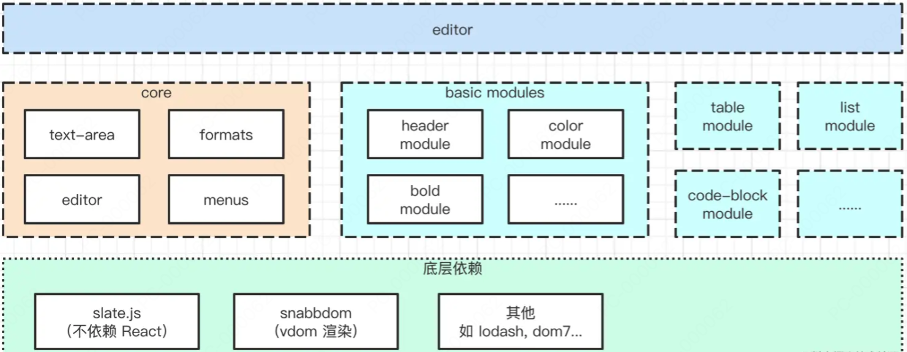

<!-- @format -->

https://juejin.cn/post/7406161967616507941#heading-6

# wangEditor 考点解析

怎么开发的 是不是基于 slatejs

# 使用主流技术

wangEditor 从 V5 版本开始，有较大的技术更新。

# 1. 升级为 L1 能力

弃用了 document.execCommand API ，使用 slate.js（但不依赖 React）为内核，升级为 L1 能力。

这也是目前主流富文本编辑器的技术方案，如知名的 Quill ProseMirror Draft 都在使用。

# 2. 使用 vdom

使用 vdom 技术（基于 snabbdom.js ）做视图更新，model 和 view 分离，增加稳定性。

# 3. 扩展性

使用扩展插件和模块的机制，保证扩展性。未来还会继续扩展更多功能。

其实，现在 wangEditor 内置的各个功能，也都是通过扩展插件和模块的形式搭建起来的。

# slate.js
Web 富文本编辑器框架 slate.js - 从基本使用到核心概念
 https://juejin.cn/post/6917123466307698696

 https://juejin.cn/post/6954896971370856485

 https://juejin.cn/post/6968061014046670884

从代码结构来看，这是一个基于模块化设计的富文本编辑器项目，使用TypeScript开发。项目采用Rollup作为构建工具，包含了多个功能模块如表格、列表等。我将分析项目的整体架构、核心模块组成、构建配置以及样式系统，帮助你更好地理解这个项目。我会重点关注模块间的依赖关系、代码组织方式以及构建流程。

          
查看项目的包结构，以了解模块化组织方式。
        
            
toolName: view_folder
            
status: success
          
/Users/a58/open_source_project/wangEditor/packages
          

通过分析项目结构，我可以为您详细介绍 wangEditor 5 这个富文本编辑器项目：

**项目概述**
- 这是一个开源的 Web 富文本编辑器，支持 JS、Vue 和 React
- 使用 TypeScript 开发，采用模块化设计架构
- 使用 Rollup 作为构建工具，支持生产环境的代码压缩和优化

**核心架构设计**
1. 模块化结构
   - core: 编辑器核心模块，包含基础编辑功能
   - editor: 主编辑器模块，负责整合各个功能模块
   - basic-modules: 基础功能模块集合，如字体、颜色、对齐等
   - 独立功能模块：
     - table-module: 表格功能
     - list-module: 列表功能
     - video-module: 视频功能
     - code-highlight: 代码高亮
     - upload-image-module: 图片上传

2. 技术特点
   - 使用 TypeScript 确保代码类型安全
   - 采用 ES6 模块化标准
   - 支持 JSX 语法（使用 snabbdom 作为 JSX 工厂）
   - 完善的测试体系，每个模块都有对应的测试用例

3. 样式系统
   - 使用 Less 预处理器
   - 采用 CSS 变量实现主题定制
   - 统一的样式变量管理（vars.less）

4. 构建配置
   - 支持 sourcemap 方便调试
   - 使用 Babel 处理兼容性
   - 集成 PostCSS 进行样式处理和优化
   - 使用 terser 进行代码压缩

5. 项目管理
   - 使用 Lerna 进行多包管理
   - 规范的版本发布流程
   - 完善的 Changelog 管理
   - 支持国际化（i18n）

**扩展性设计**
- 提供自定义模块扩展机制
- 支持自定义主题
- 提供丰富的 API 接口
- 支持多种集成方式（普通 JS、Vue、React）

## 架构图

！[image.png](./image3.png)

### 数据流转

数据流转
- 采用 model -> vdom -> DOM 的数据流转模式
- 通过 Slate 的 Node、Element、Text 等数据结构管理内容
- 实现了完整的 HTML 解析和生成机制

### 核心话术
content 的线性结构 
Selection 和 Range 
operation

## 这个项目有哪些难点？

 1、弃用 document.execCommand ， contenteditable，分离 view 和 model ，使用 slate.js 作为内核，升级为 L1 能力。

 ### 插件机制

 1. 渲染模块
- renderStyle ：样式渲染
- renderElems ：元素渲染
- parseStyleHtml ：样式解析
2. 菜单模块
- menus ：工具栏菜单配置
- 支持多个菜单项组合
3. 转换模块
- elemsToHtml ：元素到HTML的转换
- styleToHtml ：样式到HTML的转换
- parseElemsHtml ：HTML解析为元素
4. 编辑器插件
- editorPlugin ：核心编辑器扩展
- 通过 withXXX 方式扩展编辑器功能
5. 预处理模块
- preParseHtml ：HTML预处理配置
- 在解析前对HTML进行预处理

### 核心问题
1、讲一下 editor 的插件机制

这个 editor 的插件机制，其实本质上就是个配置，包含了一些方法，渲染配置，html 就是怎么给vnode 转成 node  转化配置，有时候你输入的html 需要做一个转换，解析配置也就是生成 vnode，还有菜单配置，还有编辑器的插件配置（也就是要对当前的编辑器实例做一个更改来达到适用于当前这个功能菜单） 在初始化的时候注册注册到他的内部中去， 在点击他的操作的时候，对应的就需要执行他的插件配置，然后就可以达到对应的效果。

### lemsToHtml
- 负责将编辑器中的表格元素转换为 HTML 代码
- 包含表格、行、单元格三个层级的转换配置
- 在导出内容为 HTML 时使用
### preParseHtml
- 在解析 HTML 之前进行预处理
- 处理特殊的表格结构和属性
- 确保 HTML 格式符合编辑器的要求
### parseElemsHtml
- 负责将 HTML 代码解析为编辑器内部的数据结构
- 按照单元格、行、表格的顺序进行解析
- 在粘贴或导入 HTML 内容时使用

#### 那一个字体插件举例子，他是怎么实现的呢？

1、首先我们一个插件是一个配置对象，里面包含一些方法，渲染方法，按钮配置，转换配置，解析配置等等
2、然后初始化的时候会给这个插件注册，注册完成之后，就要启动监听监听，因为你一个字体要选中变化，就要监听他的变化，我举个例子啊，就要用selectionchange  来监听选中的内容。当变化的时候更改Slate的选区，然后Slate 选区变化触发 change 事件，由于我们最开始重写了
change 方法，导致就会触发我们当前的选区变化方法，然后再触发配置侧的选区变化方法 ，然后配置侧的方法，由于在初始化的时候注册过监听，于是当选中的时候就会触发工具栏的对应内容更改
3、 如果我要更改的时候，其实这时候选区已经有了，我们直接更改就可以了

#### 架构的回答
其实架构设计的本质就是找到共通的点归纳成一块功能，如果没有共通的点就拓展并且通过一些更简单的写法和前人总结的套路来达到更方便的开发和维护

1、 插件设计
2、数据流转
3、公共模块复用
4、核心模块独立

### 再拿一个 table-module 举例子

#### 首先是配置
- 渲染配置 (renderElems)
- HTML 转换配置 (elemsToHtml)
- HTML 解析配置 (parseElemsHtml, preParseHtml)
- 菜单功能 (menus)
- 编辑器插件 (editorPlugin)
##### 代码流程
首先注册渲染配置，html转换配置，html 解析配置 

渲染配置，就是当我选中 当前的按钮的时候，他需要渲染内容的话，就需要读取渲染配置中的 vnode  然后利用 snabbdom 来生成 vnode ，然后渲染到页面上   渲染的时候利用的是 patch 方法

html转换配置(elemsToHtml) 其实就是为了为了拿到对应的 html 字符串输出出来，这些方法，其实最后就是个递归类型，然后把字符串拼接然后输出出来

HTML 解析配置（preParseHtml） 就是对转化的 html 做一个预处理，然后再解析成 vnode ，然后再渲染到页面上

(parseElemsHtml) 就是生成 vnode ，主要是处理粘贴的东西，来语义化的解决问题

菜单功能 (menus)这个就是按钮配置，这些配置，出了渲染按钮，还有绑定一些事件，然后根据这些事件来来触发功能，比如王 slate.js 的实例里面来塞入数据，然后当数据改变的时候根据这些配置来渲染对应的内容 这时候就用到了虚拟 dom 视图改变

1、细节点 hr 不可以复制，但是由于是空节点，无法高亮选中，所以最后复制出来的内容，其实是全文本内容，并没有 html 内容，要想到得到 html内容，就需要我们根据他的变化事件，来拿到 html 序列化之后的内容
2、beforeinput 劫持用户输入舍弃了 input事件拦截，因为input 是在之后处理的，不可撤销
3、放弃传统的 document.execcomond 自己实现加粗，斜体啊，下划线啊，之所以要放弃这玩意，是因为他有一些历史包袱，比如不通浏览器的实现不一样，比如加粗每个浏览器的可能还不一样，还有调试困难，状态同步困难 所以利用 slate中的一些自带execcomond 然后自己封装一些execcomond利用 利用 slate Transforms api

## 遇到的难点

我说一个数据标准化的问题吧，因为这个当时是我处理的。
这个其实是我最开始没有从头干开发过富文本这块的内容，没踩过坑，后来，有一些别人提的 iussus 才意识到的问题，因为我们需要有一些富文本内容，需要给别的端展示，比如说，h5端，需要用 v-html 来展示，我们之前的方案，是给输入框内部的内容直接导出出来，然后给一些烂七八糟的样式过滤掉就可以了，只留一些内联样式， 但后续我们去写一些工具，比如，无序列表，有序列表，由于我们没有用像 tinymce 用 iframe 来解决样式污染的问题，所以我们必须自定义样式，所以就必须自己写样式来代替原来的 ul li 这种的，  我么当时用的是 span 来实现的， 这样就会有个问题，导出 html 的内容在别的地方就没法用，所以我们就重新设计了这一块内容，我们单独写了个插件，来做数据标准化，利用 slate 模型为核心数据，根据这个输出标准化可以入库的内容，在当前编辑器中展示，却是正常的自己写的内容

再可以列举一下同步选区的问题，选区问题我觉得是我遇到的比较麻烦的情况，因为 slate 维护了一个选区，我们浏览器自己也维护了一个选区，这就导致两边的数据同步特别费劲，所有后来，就设计了两个同步选区的方法，一个是给 dom 选区同步给slate 模型，一个是个 slate 模型的选区同步到 dom 

从第三方复制一些 xss 攻击，这个其实就是找到一些危险标签，在对这个标签做解析的时候，给他过滤掉， 然后还有一些特殊字符转义，来规避麻烦，反正复制粘贴是一个特别麻烦的事情，一些垃圾样式去除的问题，复制出去同样的也是这样但是 wangeditor 没做处理，复制就是复制，原封不动，但是有的粘贴目标会给他过滤掉，只保留文本内容， 比如hr 可以复制，但看不到

## 举一个自己写 hr 分隔线的例子

## 协同编辑

 底层OT算法与CRDT 算法具体我没研究 ，Yjs，还需要自己实现服务端功能，后来觉得我们这编辑器还是要做一个开源富文本编辑器本来功能，就放弃掉了