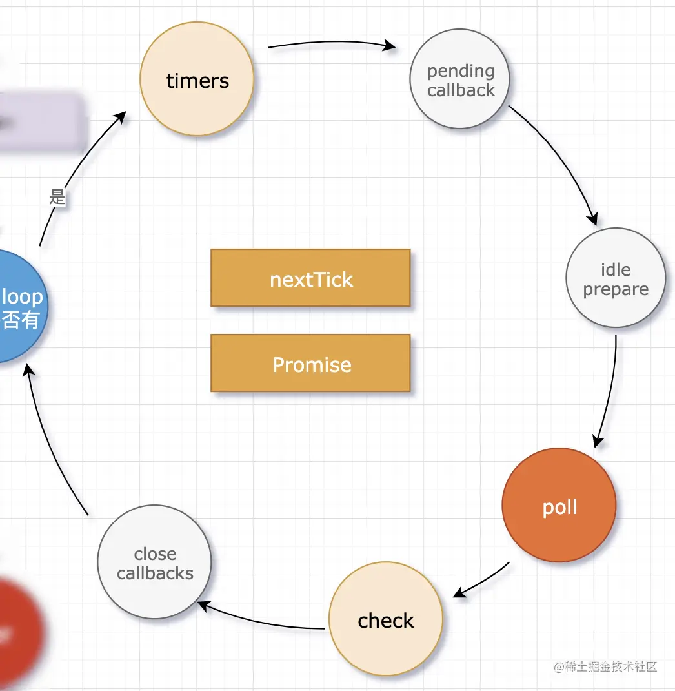

<!-- @format -->

# nodejs 热门考题

## 1. nodejs服务器怎样能接受大量的并发流量？
要使Node.js服务器能够处理大量并发流量，可以从以下几个方面进行优化：

### 1. **使用异步非阻塞I/O**
Node.js的核心优势在于其异步非阻塞I/O模型。确保代码中所有I/O操作（如数据库查询、文件读写、网络请求等）都是异步的，以避免阻塞事件循环。

### 2. **集群模式**
利用Node.js的`cluster`模块创建多个工作进程，充分利用多核CPU。每个进程都可以处理请求，从而提高并发处理能力。

```javascript
const cluster = require('cluster');
const os = require('os');

if (cluster.isMaster) {
  const numCPUs = os.cpus().length;
  for (let i = 0; i < numCPUs; i++) {
    cluster.fork();
  }
} else {
  const express = require('express');
  const app = express();
  app.get('/', (req, res) => {
    res.send('Hello World!');
  });
  app.listen(3000);
}
```

### 3. **负载均衡**
使用负载均衡器（如Nginx、HAProxy）将流量分发到多个Node.js实例。这不仅可以提高并发处理能力，还能增强系统的可用性和可靠性。

### 4. **优化数据库访问**
- **连接池**：使用数据库连接池来复用数据库连接，减少连接建立和关闭的开销。
- **索引优化**：确保数据库查询使用了适当的索引，以减少查询时间。
- **缓存**：使用Redis或Memcached等缓存系统来缓存频繁访问的数据，减少数据库负载。

### 5. **使用高效的中间件**
选择性能高效的中间件，并尽量减少中间件的使用数量。例如，使用`compression`中间件来压缩响应数据，减少传输时间。

```javascript
const compression = require('compression');
const express = require('express');
const app = express();
app.use(compression());
app.get('/', (req, res) => {
  res.send('Hello World!');
});
app.listen(3000);
```

### 6. **代码优化**
- **避免阻塞操作**：确保代码中没有长时间运行的同步操作。
- **减少内存泄漏**：定期检查并修复内存泄漏问题，使用工具如`node-inspect`或`clinic`进行性能分析。

### 7. **使用CDN**
将静态资源（如图片、CSS、JavaScript文件）托管在CDN上，减少服务器的负载，并加快资源的加载速度。

### 8. **监控和日志**
使用监控工具（如Prometheus、Grafana）和日志工具（如ELK Stack）来实时监控服务器性能，及时发现和解决问题。

### 9. **水平扩展**
当单台服务器无法满足需求时，可以通过水平扩展的方式增加服务器数量，使用负载均衡器将流量分发到多台服务器上。

### 10. **使用高性能的Web服务器**
考虑使用高性能的Web服务器如`Fastify`替代`Express`，以进一步提升性能。

```javascript
const fastify = require('fastify')({ logger: true });

fastify.get('/', async (request, reply) => {
  return { hello: 'world' };
});

const start = async () => {
  try {
    await fastify.listen(3000);
    fastify.log.info(`server listening on ${fastify.server.address().port}`);
  } catch (err) {
    fastify.log.error(err);
    process.exit(1);
  }
};

start();
```

通过以上方法，可以显著提升Node.js服务器处理大量并发流量的能力。

## 2、nodejs 事件循环机制




Node.js 的事件循环（Event Loop）是其异步非阻塞 I/O 模型的核心机制。它允许 Node.js 高效地处理大量并发操作，而无需创建多个线程。以下是 Node.js 事件循环机制的详细解释：

### 事件循环的基本概念
事件循环是一个持续运行的进程，负责处理事件和执行回调函数。它不断地检查是否有待处理的事件，并执行相应的回调函数。

### 事件循环的阶段
Node.js 的事件循环分为多个阶段，每个阶段都有特定的任务：

1. **Timers 阶段**：
   - 处理 `setTimeout` 和 `setInterval` 的回调。
   - 检查是否有到期的定时器，如果有，则执行相应的回调函数。

2. **Pending Callbacks 阶段**：
   - 处理一些系统操作的回调，例如 TCP 错误。
   - 执行上一轮循环中未处理的回调。

3. **Idle, Prepare 阶段**：
   - 仅供内部使用，开发者通常不需要关心。

4. **Poll 阶段**：
   - 检索新的 I/O 事件。
   - 执行与 I/O 相关的回调（例如文件读取、网络请求等）。
   - 如果 Poll 队列为空，事件循环会检查是否有到期的定时器，如果有，则跳转到 Timers 阶段执行回调。

5. **Check 阶段**：
   - 处理 `setImmediate` 的回调。
   - 执行所有通过 `setImmediate` 设置的回调函数。

6. **Close Callbacks 阶段**：
   - 处理一些关闭事件的回调，例如 `socket.on('close', ...)`。
   - 执行所有通过 `close` 事件设置的回调函数。

### 事件循环的执行顺序
事件循环按照上述阶段的顺序依次执行，每个阶段都会处理相应的任务。当一个阶段的任务全部执行完毕后，事件循环会进入下一个阶段。

### 微任务（Microtasks）
在事件循环的每个阶段之间，Node.js 会处理微任务队列。微任务包括 `Promise` 的回调和 `process.nextTick` 的回调。微任务的优先级高于普通任务，会在当前阶段结束后立即执行。

### 示例代码
以下是一个简单的示例，展示了事件循环的执行顺序：

```javascript
setTimeout(() => {
  console.log('setTimeout');
}, 0);

setImmediate(() => {
  console.log('setImmediate');
});

process.nextTick(() => {
  console.log('nextTick');
});

Promise.resolve().then(() => {
  console.log('Promise');
});

console.log('Main');
```

输出顺序为：
```
Main
nextTick
Promise
setTimeout
setImmediate
```

### 解释
1. **Main**：同步代码最先执行。
2. **nextTick**：`process.nextTick` 的回调在当前阶段结束后立即执行。
3. **Promise**：`Promise` 的回调作为微任务，在当前阶段结束后立即执行。
4. **setTimeout**：`setTimeout` 的回调在 Timers 阶段执行。
5. **setImmediate**：`setImmediate` 的回调在 Check 阶段执行。

### 总结
Node.js 的事件循环机制是其异步非阻塞 I/O 模型的核心。通过理解事件循环的各个阶段和执行顺序，开发者可以更好地编写高效的异步代码，充分利用 Node.js 的性能优势。

## 3、setImmediate() 与 setTimeout(0) 的对比

`setImmediate()` 和 `setTimeout(fn, 0)` 在 Node.js 中都是用于异步执行回调函数的方法，但它们在事件循环中的执行顺序和机制有所不同。以下是它们的详细对比：

### 1. **执行阶段**
- **`setImmediate()`**：
  - 回调函数在事件循环的 **Check 阶段** 执行。
  - 确保在当前事件循环的 Poll 阶段结束后立即执行。

- **`setTimeout(fn, 0)`**：
  - 回调函数在事件循环的 **Timers 阶段** 执行。
  - 尽管延迟时间为 0，但它仍然会在下一个 Timers 阶段执行。

### 2. **执行顺序**
- **在 I/O 回调中**：
  - 如果在 I/O 回调（如 `fs.readFile` 的回调）中使用 `setImmediate()` 和 `setTimeout(fn, 0)`，`setImmediate()` 的回调会先于 `setTimeout(fn, 0)` 执行。
  
  ```javascript
  const fs = require('fs');

  fs.readFile(__filename, () => {
    setTimeout(() => {
      console.log('setTimeout');
    }, 0);

    setImmediate(() => {
      console.log('setImmediate');
    });
  });
  ```

  输出顺序为：
  ```
  setImmediate
  setTimeout
  ```

- **在主模块中**：
  - 如果在主模块中直接使用 `setImmediate()` 和 `setTimeout(fn, 0)`，它们的执行顺序可能会受到事件循环初始化的影响，通常 `setTimeout(fn, 0)` 会先于 `setImmediate()` 执行。

  ```javascript
  setTimeout(() => {
    console.log('setTimeout');
  }, 0);

  setImmediate(() => {
    console.log('setImmediate');
  });
  ```

  输出顺序可能为：
  ```
  setTimeout
  setImmediate
  ```

### 3. **性能**
- **`setImmediate()`**：
  - 由于 `setImmediate()` 的回调在 Check 阶段执行，通常比 `setTimeout(fn, 0)` 更快，尤其是在 I/O 操作的回调中。

- **`setTimeout(fn, 0)`**：
  - 由于 `setTimeout(fn, 0)` 的回调在 Timers 阶段执行，可能会受到系统调度的影响，执行时间稍长。

### 4. **使用场景**
- **`setImmediate()`**：
  - 适用于需要在当前事件循环的 Poll 阶段结束后立即执行的任务。
  - 常用于确保某些操作在所有 I/O 事件处理完毕后执行。

- **`setTimeout(fn, 0)`**：
  - 适用于需要在下一个事件循环的 Timers 阶段执行的任务。
  - 常用于延迟执行某些操作，确保它们在其他任务之后执行。

### 5. **代码示例**
以下是一个综合示例，展示了 `setImmediate()` 和 `setTimeout(fn, 0)` 的不同行为：

```javascript
const fs = require('fs');

// I/O 回调中的执行顺序
fs.readFile(__filename, () => {
  setTimeout(() => {
    console.log('setTimeout in I/O callback');
  }, 0);

  setImmediate(() => {
    console.log('setImmediate in I/O callback');
  });
});

// 主模块中的执行顺序
setTimeout(() => {
  console.log('setTimeout in main module');
}, 0);

setImmediate(() => {
  console.log('setImmediate in main module');
});
```

输出顺序可能为：
```
setImmediate in main module
setTimeout in main module
setImmediate in I/O callback
setTimeout in I/O callback
```

### 总结
- **`setImmediate()`** 在 Check 阶段执行，适合在当前事件循环的 Poll 阶段结束后立即执行的任务。
- **`setTimeout(fn, 0)`** 在 Timers 阶段执行，适合在下一个事件循环的 Timers 阶段执行的任务。
- 在 I/O 回调中，`setImmediate()` 的回调会先于 `setTimeout(fn, 0)` 执行；而在主模块中，执行顺序可能会有所不同。

理解这两者的区别有助于开发者更好地控制异步代码的执行顺序和性能。

## 4、nodejs nextTick 与 Promise 区别

在 Node.js 中，`process.nextTick()` 和 `Promise` 都是用于异步执行代码的机制，但它们在事件循环中的执行顺序和行为有所不同。以下是它们的详细对比：

### 1. **执行顺序**
- **`process.nextTick()`**：
  - 回调函数会在当前操作完成后立即执行，**早于任何 I/O 事件**。
  - 属于 **微任务（Microtask）**，但优先级高于 `Promise` 的回调。

- **`Promise`**：
  - 回调函数会在当前事件循环的末尾执行，**早于下一个事件循环的开始**。
  - 也属于 **微任务（Microtask）**，但优先级低于 `process.nextTick()`。

### 2. **事件循环中的位置**
- **`process.nextTick()`**：
  - 在每个事件循环阶段的**间隙**执行。
  - 即在当前阶段结束后、下一个阶段开始前执行。

- **`Promise`**：
  - 在当前事件循环的 **微任务队列** 中执行。
  - 即在当前阶段结束后、下一个阶段开始前执行，但在 `process.nextTick()` 之后。

### 3. **代码示例**
以下是一个简单的示例，展示了 `process.nextTick()` 和 `Promise` 的执行顺序：

```javascript
process.nextTick(() => {
  console.log('nextTick');
});

Promise.resolve().then(() => {
  console.log('Promise');
});

console.log('Main');
```

输出顺序为：
```
Main
nextTick
Promise
```

### 4. **执行机制**
- **`process.nextTick()`**：
  - 将回调函数放入 **nextTick 队列**。
  - 在当前操作完成后立即执行，**早于任何 I/O 事件**。

- **`Promise`**：
  - 将回调函数放入 **微任务队列**。
  - 在当前事件循环的末尾执行，**早于下一个事件循环的开始**。

### 5. **使用场景**
- **`process.nextTick()`**：
  - 适用于需要立即执行的任务，例如在事件发射后立即处理事件。
  - 常用于确保某些操作在所有 I/O 事件处理之前执行。

- **`Promise`**：
  - 适用于需要异步处理的任务，例如异步操作的结果处理。
  - 常用于处理异步操作的结果，确保代码的清晰和可维护性。

### 6. **性能**
- **`process.nextTick()`**：
  - 由于 `process.nextTick()` 的回调会立即执行，可能会导致 **I/O 饥饿**，即大量 `nextTick` 回调阻塞 I/O 事件的处理。
  - 需要谨慎使用，避免过度使用。

- **`Promise`**：
  - 由于 `Promise` 的回调在当前事件循环的末尾执行，不会阻塞 I/O 事件的处理。
  - 更适合处理大量的异步任务。

### 7. **综合示例**
以下是一个综合示例，展示了 `process.nextTick()` 和 `Promise` 的不同行为：

```javascript
setTimeout(() => {
  console.log('setTimeout');
}, 0);

process.nextTick(() => {
  console.log('nextTick');
});

Promise.resolve().then(() => {
  console.log('Promise');
});

console.log('Main');
```

输出顺序为：
```
Main
nextTick
Promise
setTimeout
```

### 总结
- **`process.nextTick()`** 的回调会在当前操作完成后立即执行，**早于任何 I/O 事件**，优先级高于 `Promise`。
- **`Promise`** 的回调会在当前事件循环的末尾执行，**早于下一个事件循环的开始**，优先级低于 `process.nextTick()`。
- 理解这两者的区别有助于开发者更好地控制异步代码的执行顺序和性能，避免潜在的问题。